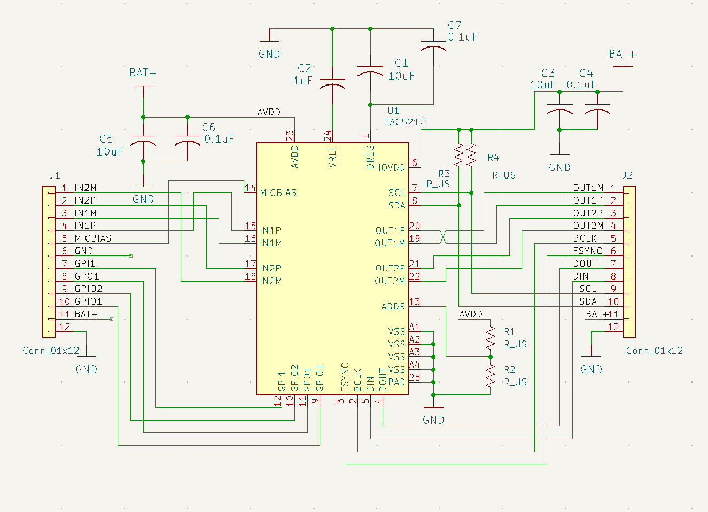
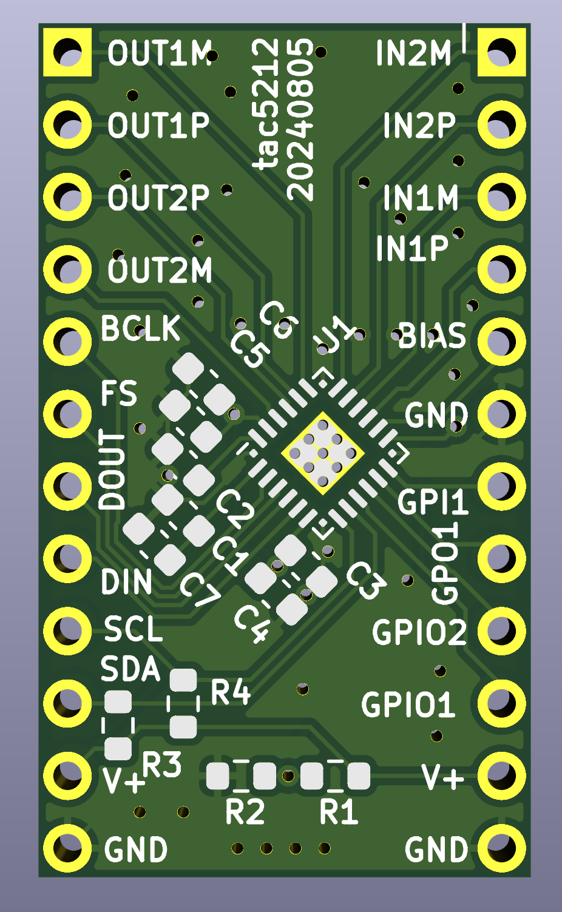
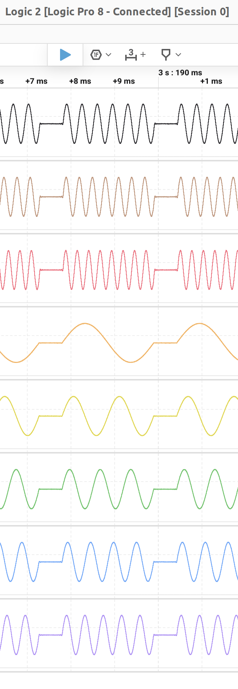
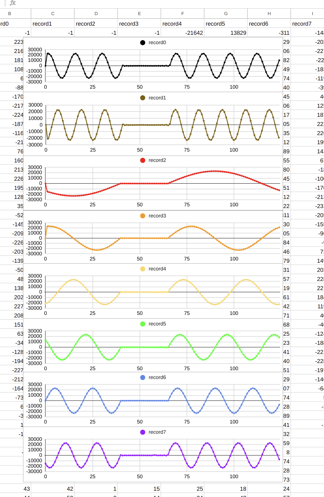

# tac5

This repo describes PCBs and rp2040 CircuitPython support for TI's [TAC5xxx](https://www.ti.com/product/TAC5212) audio codecs.

* [`pcm.py`](pcm.py) uses the rp2040 PIO to implement a PCM interface to the TAC5 which supports arbitrary numbers of channels, word sizes, and sample rates.

* [`tac5.py`](tac5.py) implements a TAC5 class which knows how to initialize the TAC5xxx over I2C, write to its DACs, and read from its ADCs.

* If multiple TAC5xxx parts with different I2C addresses are present, they are assumed to be wired in parallel for multichannel operation and [configured]( https://docs.google.com/spreadsheets/d/1LnI_OwJfJHtquBkj7qKH8Fg3jmsCv9cRniIS2uqMfjU/edit?usp=sharing) appropriately.  In this mode, each chip uses one time slot
in the DOUT signal and makes its DOUT Hi-Z at other times.  

* In the first example shown here, 4 TAC5212's are connected with BCLK, FSYNC, DOUT, DIN, SCL, and SDA in parallel.  On each chip, the differential DAC outputs are connected to the differential ADC inputs to provide test signals for the ADCs, i.e. OUT1P -> IN1P, OUT1M -> IN1M, OUT2P -> IN2P, OUT2M -> IN2M.

* Chips are mounted on [breakout boards](https://www.pcbway.com/project/shareproject/Breakout_board_for_the_TI_TAC5212_audio_codec_ecc0a61b.html).  KiCad files for these boards are [here](pcb).  Schematic and layout look like this:

 

* The second example shows a loopback test of streaming output and input performed without a codec by connecting DOUT to DIN.  This code depends on extensions to `rp2pio` found in https://github.com/adafruit/circuitpython/pull/9659

## Codec example

```python
Adafruit CircuitPython 9.1.0-beta.3-76-g2f62612186-dirty on 2024-07-18; Adafruit Feather RP2040 with rp2040
>>> 
>>> import tac5
>>> t = tac5.TAC5()
>>> t.play()
playing...
>>> t.record()
sample,record0,record1,record2,record3,record4,record5,record6,record7,
0,-1,-1,-1,-1,-21642,13829,-311,-14878,
1,22355,-20880,-14861,22749,-19762,8760,6829,-20253,
2,21608,-13819,-15930,23037,-17183,3144,13306,-22783,
3,18190,-3347,-16936,22962,-13994,-2666,18482,-22111,
4,10858,7951,-17876,22524,-10311,-8313,21849,-18332,
5,602,17291,-18745,21730,-6263,-13440,23074,-11979,
6,-8849,22352,-19541,20593,-1995,-17725,22040,-3945,
7,-17070,21881,-20257,19131,2341,-20896,18845,4634,
8,-21748,15993,-20896,17368,6597,-22754,13806,12577,
9,-22490,6149,-21452,15331,10620,-23182,7417,18743,
...(115 more lines)
```

When called without arguments, `play()` creates test output (right now sine waves of various frequencies separated by gaps) for each DAC channel and sets up the interface to repeatedly send the data to the DACs in the background.
When `record()` is called without arguments, it creates a buffer the same size as the playing buffer, fills it with ADC samples, and prints out the returned data in
CSV format.  The table below compares the DAC outputs as seen on a scope with the ADC outputs plotted on a spreadsheet:

| DAC output |  &nbsp; &nbsp; &nbsp; &nbsp; &nbsp; &nbsp; &nbsp; &nbsp; &nbsp; &nbsp; &nbsp; &nbsp; &nbsp; &nbsp; &nbsp;&nbsp; &nbsp; &nbsp;  | ADC output |
| ---------- | ---- |---------- |
|    | |  |

## Loopback example, single buffered

```python
Adafruit CircuitPython 9.1.0-beta.3-179-g1db7f36b79-dirty on 2024-10-24; Adafruit Feather RP2040 with rp2040
>>> import tac5
>>> t = tac5.TAC5(channels=2, width=8, sample_rate=12000, address=None)
>>> t.rec(length=10)
recording...
>>> t.play(length=10, test='count')
playing...
>>> t.show(t.record_loop_buffer)
'sample'; 'ch0'; 'ch1'
0; -10; -9
1; -8; -7
2; -6; -5
3; -4; -3
4; -2; -1
5; 0; 1
6; 2; 3
7; 4; 5
8; 6; 7
9; 8; 9
>>> t.show(t.play_loop_buffer, shift=False)
'sample'; 'ch0'; 'ch1'
0; -10; -9
1; -8; -7
2; -6; -5
3; -4; -3
4; -2; -1
5; 0; 1
6; 2; 3
7; 4; 5
8; 6; 7
9; 8; 9
```


## Loopback example, double buffered

Note that the `count` test data generated by `tac5` is offset by 1 in `play_loop2_buffer` to distinguish it from the other buffer's data. 

```python
Adafruit CircuitPython 9.1.0-beta.3-179-g1db7f36b79-dirty on 2024-10-24; Adafruit Feather RP2040 with rp2040
>>> import tac5
>>> t = tac5.TAC5(channels=2, width=8, sample_rate=12000, address=None)
>>> t.rec(length=10, double_buffer=True)
recording...
>>> t.play(length=10, test='count', double_buffer=True)
playing...
>>> t.show(t.record_loop_buffer)
'sample'; 'ch0'; 'ch1'
0; -9; -8
1; -7; -6
2; -5; -4
3; -3; -2
4; -1; 0
5; 1; 2
6; 3; 4
7; 5; 6
8; 7; 8
9; 9; 10
>>> t.show(t.record_loop2_buffer)
'sample'; 'ch0'; 'ch1'
0; -10; -9
1; -8; -7
2; -6; -5
3; -4; -3
4; -2; -1
5; 0; 1
6; 2; 3
7; 4; 5
8; 6; 7
9; 8; 9
>>> t.show(t.play_loop_buffer, shift=False)
'sample'; 'ch0'; 'ch1'
0; -10; -9
1; -8; -7
2; -6; -5
3; -4; -3
4; -2; -1
5; 0; 1
6; 2; 3
7; 4; 5
8; 6; 7
9; 8; 9
>>> t.show(t.play_loop2_buffer, shift=False)
'sample'; 'ch0'; 'ch1'
0; -9; -8
1; -7; -6
2; -5; -4
3; -3; -2
4; -1; 0
5; 1; 2
6; 3; 4
7; 5; 6
8; 7; 8
9; 9; 10
```
