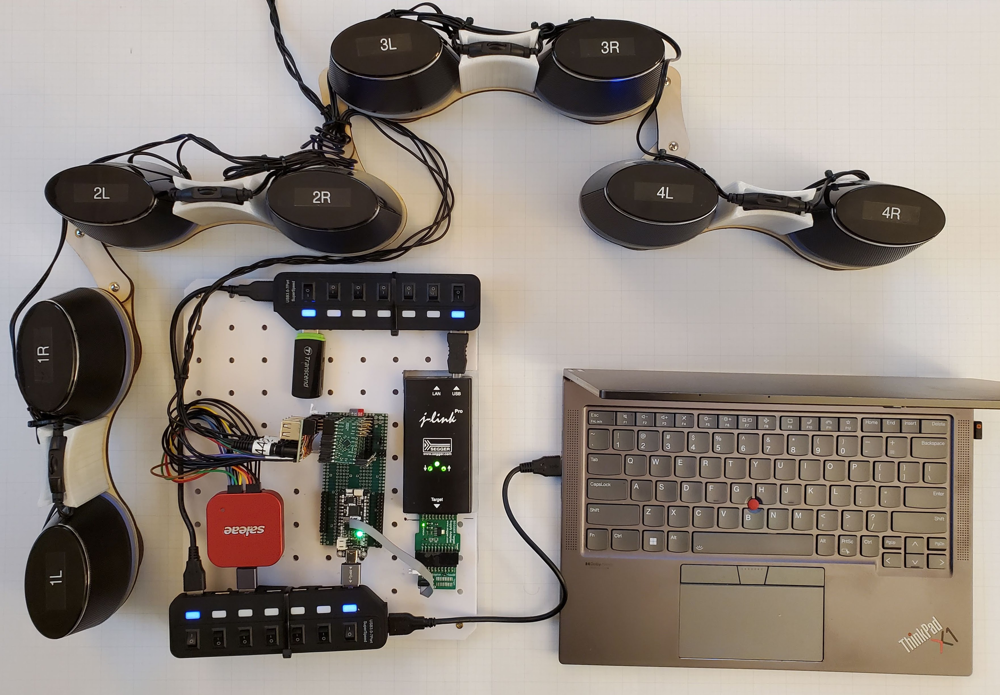
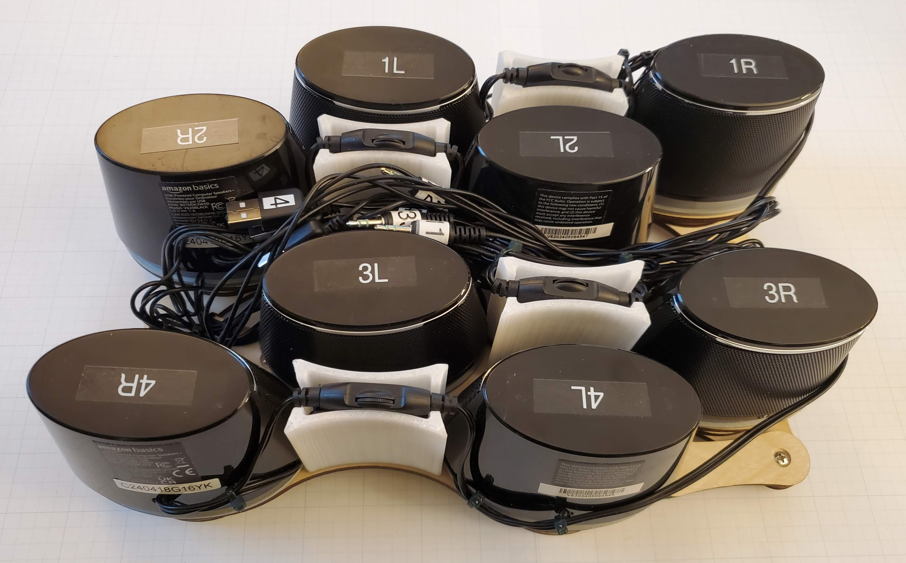

# Speakers

The eight-channel speaker setup used to test `tac5` is shown below.  Four off-the-shelf USB-powered [stereo speakers](https://www.amazon.com/dp/B07DDK3W5D) mounted on a [laser-cut](speaker_mount_x4.pdf) articulated base with [cable corrals](speaker_corral.stl) provide a compact setup which folds for portability.  The speakers' four 1/8" stereo plugs connect to the TAC5 DAC outputs via a hand-wired transition board.

